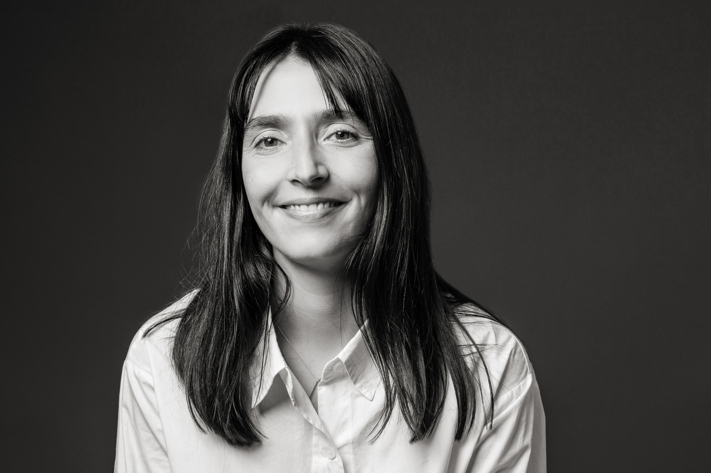

  

    
  

  

  Welcome!  
    I am a Post-Doc at the <a href="https://www.economics.ku.dk/">Department of Economics, University of Copenhagen</a>.  
	My main research interests are economic and social integration, with a current focus on the early integration outcomes of Ukrainian refugees in Denmark.  
	I will be visiting Stanford from April until June 2026. 
  

